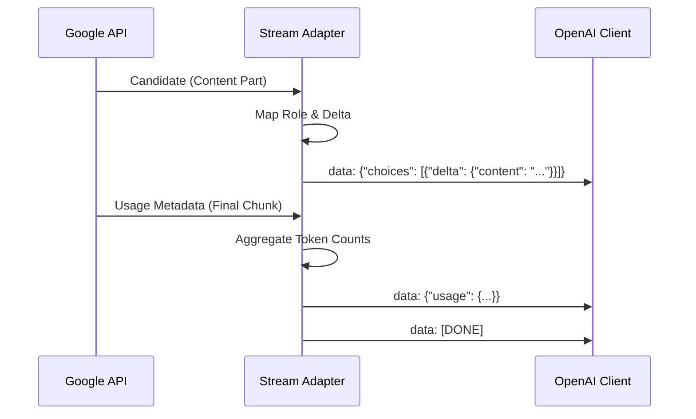

# Architecture & Intervals

This document explains the internal design of the Proxy Server. It's intended
for developers contributing to the project or those curious about how the
translation layer works.

## Core Components

The server is built on **Fastify** and uses a modular plugin architecture.

## High Level Overview

```mermaid
graph TD
    Client[Client (OpenAI SDK)] -->|HTTP POST| Proxy[Gemini Proxy]
    Proxy -->|Auth Check| Auth{Authorized?}
    Auth -->|No| 401[401 Unauth]
    Auth -->|Yes| Parser[Request Parser]
    Parser -->|Convert Format| GeminiReq[Gemini Request]
    GeminiReq -->|gRPC/HTTP| Google[Google Gemini API]
    Google -->|Stream Events| Adapter[Stream Adapter]
    Adapter -->|SSE Chunks| Client
```

### 1. Request Handling Flow

1.  **Auth Plugin** (`plugins/auth.ts`):
    - Intercepts request `onRequest`.
    - Checks `Authorization: Bearer <PROXY_API_KEY>`.
    - Timing-safe comparison to prevent side-channel attacks.
    - Bypasses public routes (`/health`, `/docs`).

2.  **Parsing & Conversion**:
    - **OpenAI -> Gemini**: `src/routes/chat-completions.ts` receives the OpenAI
      standard body.
    - `src/converters/message-converter.ts`: Maps roles (`system`, `user`,
      `assistant`), handles image inputs (base64/url), and converts tool calls.

3.  **Gemini Client Interaction**:
    - The proxy uses `@google/gemini-cli-core` to talk to Google's API.
    - Single-turn vs Multi-turn: The proxy reconstructs "sessions" based on the
      message history provided in the request.

4.  **Streaming & Response**:
    - **Gemini -> OpenAI**: `src/streaming/stream-adapter.ts`.
    - This is the most complex part. Gemini emits `usageMetadata`, `candidates`,
      and `safetyRatings`.
    - The adapters converts these into OpenAI's `delta` format for SSE.
    - **Thinking/Reasoning**: Gemini 2.0 sends "thought" parts. We configure
      whether to forward these as text or strip them via `INCLUDE_THINKING` env
      var.

### Session Management

For non-streaming requests, we use a transient `ChatSession`. For streaming, we
hook into the generator `streamResult`.

> **Note**: State is stateless from the proxy's perspective. The client SDK
> sends the full context (history) on every request, which fits the REST
> paradigm.

## Streaming Architecture

How we convert Google's stream to OpenAI's SSE format:



## Directory Structure

```text
src/
├── converters/       # Message format translation logic
├── plugins/          # Fastify plugins (Auth, Logger)
├── routes/           # API Endpoints
│   ├── chat-completions.ts  # /v1/chat/completions
│   └── models.ts            # /v1/models
├── services/         # Business logic integration
└── streaming/        # SSE Stream Adapters
```
