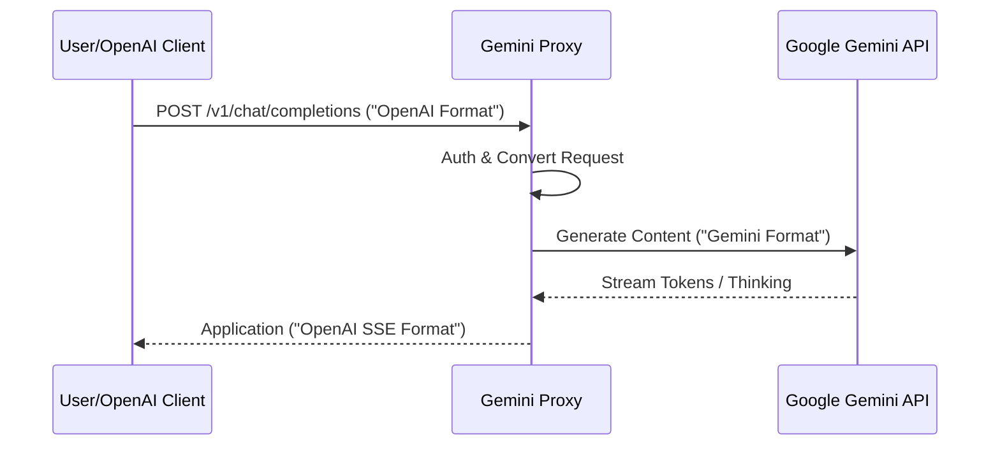

# Introduction to Gemini CLI Proxy Server

> **OpenAI-compatible API wrapper for Google's Gemini models.**

This project acts as a bridge, allowing any tool or library compatible with
OpenAI's API (like certain VS Code extensions, libraries, or scripts) to talk to
Google's powerful Gemini models.

## Why use this?

1.  **Compatibility**: Use Gemini with tools built for OpenAI (GPT-4, etc.).
2.  **Multimodal**: Full support for images and complex inputs.
3.  **Control**: Self-hosted, privacy-focused proxy for your interactions.
4.  **Flexibility**: Run it locally, in Docker, or on a private VPS.

## Key Features

- 🚀 **Fastify-based**: High performance, low overhead.
- ⚡ **Streaming**: Full SSE (Server-Sent Events) support for real-time tokens.
- 🔐 **Flexible Auth**: Supports API Keys, OAuth 2.0 (via `gemini` CLI), and GCP
  Vertex AI.
- 🛡️ **Docker Ready**: Production-grade Docker setup for VPS deployment.
- 🧠 **Reasoning/Thinking**: Supports Gemini 2.0's "thinking" process (can be
  exposed or hidden).

## How it works

